# Task Management System

## Overview

The Task Management System is a web-based application developed using Spring Boot that helps organizations and individuals efficiently manage daily tasks and track progress. The system provides secure authentication, task assignment, task monitoring, email notifications, password recovery, and task-based discussions through comments.

The application supports role-based access control, allowing Managers and Employees to collaborate while maintaining appropriate task visibility and security.

---

## System Architecture

The application follows a layered architecture pattern that separates presentation, business logic, data access, and persistence layers to ensure maintainability, scalability, and security.

### Architecture Diagram

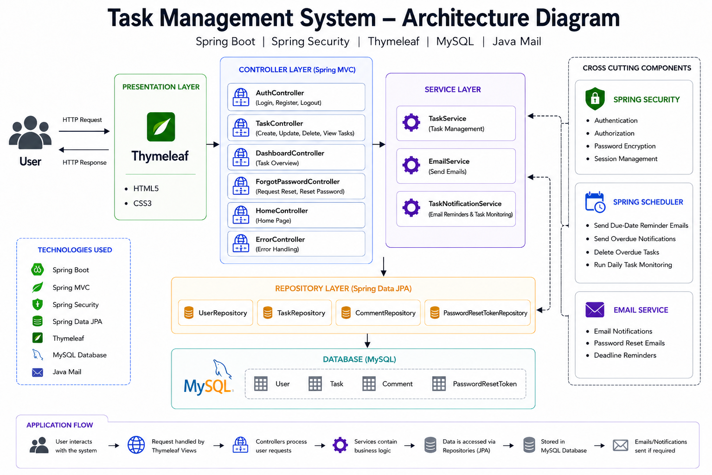

### Architecture Flow

1. Users interact with the system through Thymeleaf-based web pages.
2. Requests are processed by Spring MVC Controllers.
3. Controllers delegate operations to Service classes.
4. Services implement business logic and validations.
5. Repositories communicate with the MySQL database using Spring Data JPA.
6. Spring Security handles authentication and authorization.
7. Spring Scheduler monitors task deadlines.
8. Email services send reminder and password reset notifications.

---

## Application Screenshots

### Landing Page

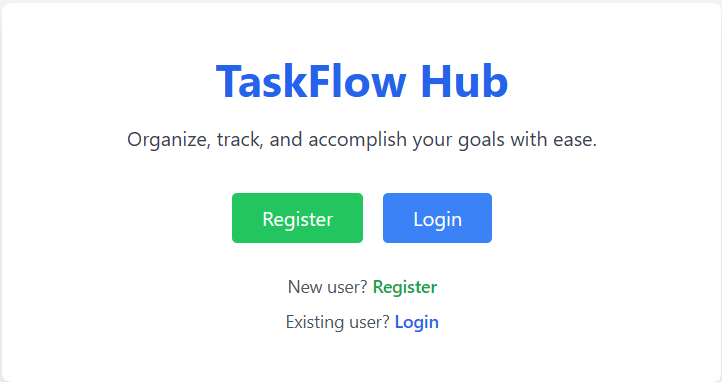

### User Registration

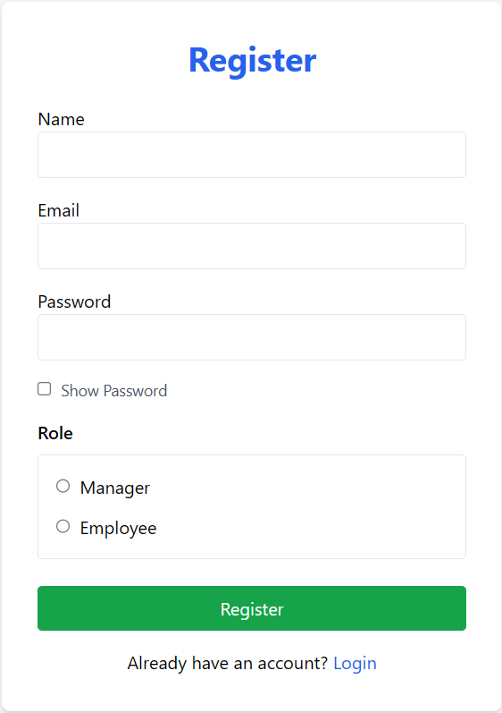

### User Login

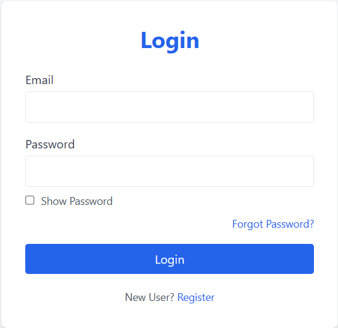

### Forgot Password
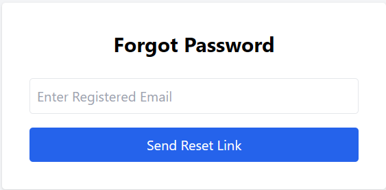

### Password Reset Email


### Reset Password
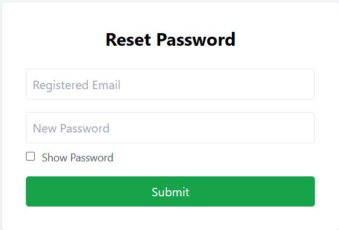

### Employee Dashboard

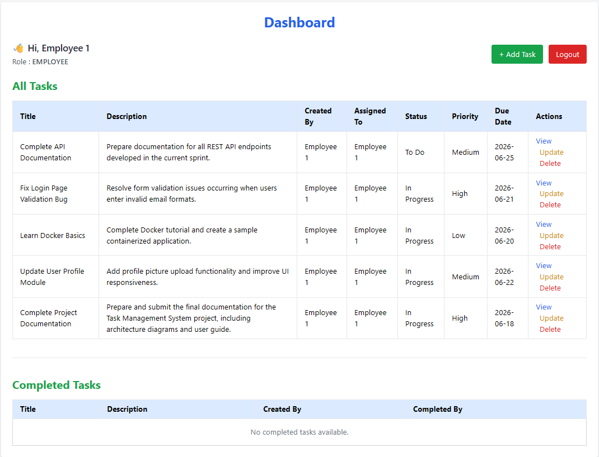

### Add Task

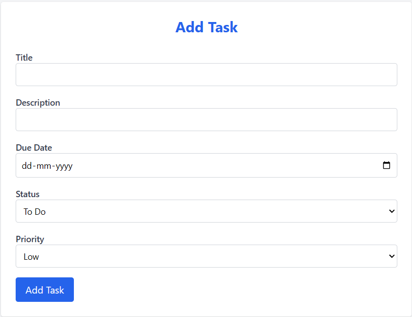

### Update Task

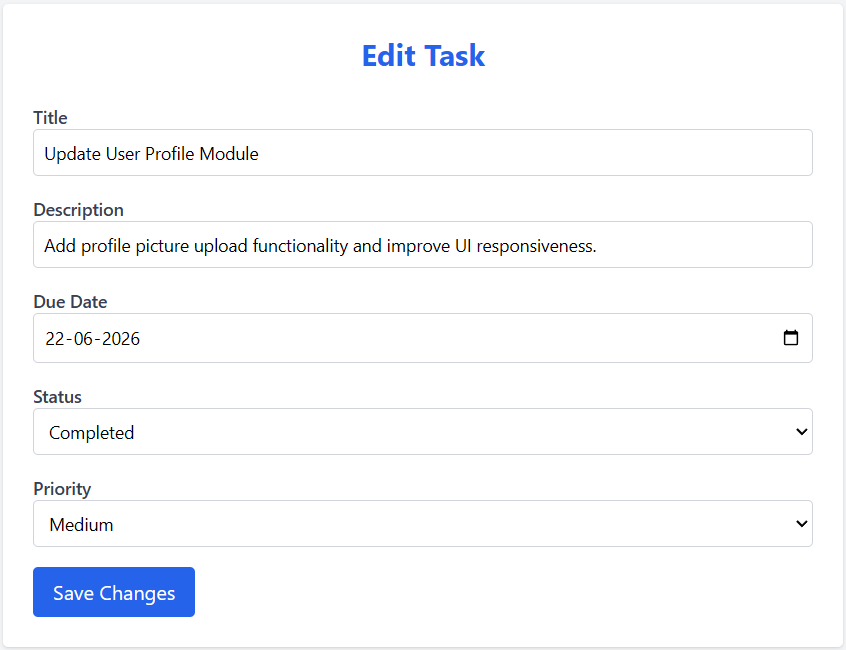

### Task Details

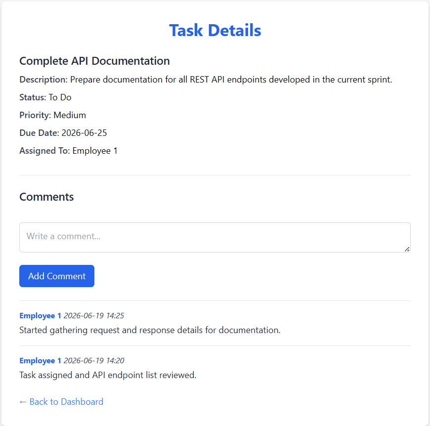

### Manager Dashboard

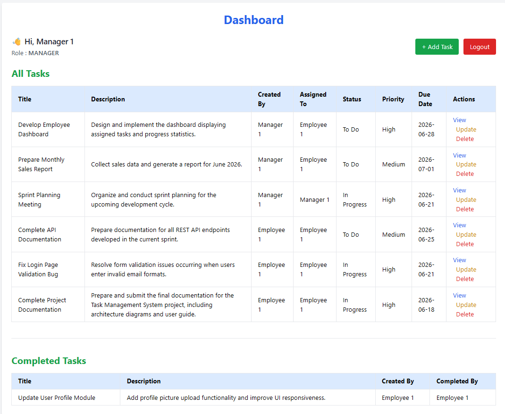

### Task Discussion / Comments

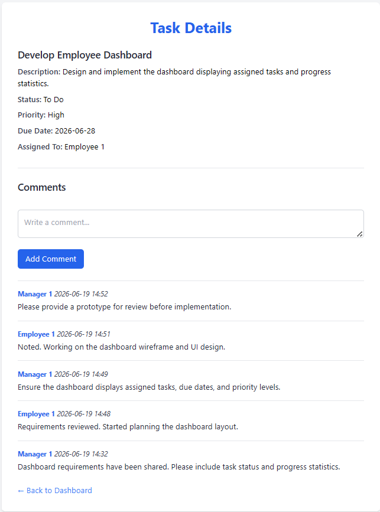

---

## Features

### User Management

* User Registration
* User Login & Logout
* Secure Authentication using Spring Security
* Role-Based Access Control (Manager / Employee)
* Forgot Password Functionality
* Password Reset via Email

### Task Management

* Create New Tasks
* Assign Tasks to Employees
* View Task Details
* Update Existing Tasks
* Delete Tasks
* Update Task Status
* Priority Selection (Low, Medium, High)
* Automatic Handling of Overdue Tasks

### Dashboard

* Display Active Tasks
* Display Completed Tasks
* Role-Based Task Visibility

### Comments & Discussions

* Add Comments to Tasks
* View Task Discussions
* Comment Author Tracking
* Timestamp-Based Comment History

### Notifications

* Email Reminder Notifications
* Scheduled Task Monitoring
* Deadline Alerts
* Automated Reminder Service

### Security & Access Control

* Managers can view tasks created by themselves
* Managers can view employee-created employee-assigned tasks
* Managers cannot view another manager's private tasks
* Employees can view only tasks assigned to them
* Protected Task Detail Access
* Secure Route Handling

---

## Technologies Used

### Backend

* Java 17
* Spring Boot 3.2
* Spring MVC
* Spring Data JPA
* Spring Security

### Frontend

* Thymeleaf
* HTML5
* CSS3

### Database

* MySQL

### Additional Tools

* Maven
* JavaMail Sender
* Spring Scheduler

---

## Project Structure

```text
src/
├── main/
│   ├── java/
│   │   └── com.example.task_management/
│   │       ├── config/
│   │       ├── controller/
│   │       ├── model/
│   │       ├── repository/
│   │       └── service/
│   └── resources/
│       ├── static/
│       ├── templates/
│       └── application.properties
└── test/
```

---

## Prerequisites

Before running the application, ensure the following software is installed:

* Java JDK 17 or later
* Maven 3.8+
* MySQL Server 8.0+
* IntelliJ IDEA / Eclipse / VS Code

---

## Database Configuration

Create a MySQL database:

```sql
CREATE DATABASE task_management_system;
```

Configure the database connection inside `application.properties`:

```properties
spring.datasource.url=jdbc:mysql://localhost:3306/task_management_system
spring.datasource.username=YOUR_USERNAME
spring.datasource.password=YOUR_PASSWORD
```

---

## Email Configuration

Configure SMTP settings inside `application.properties`:

```properties
spring.mail.username=YOUR_EMAIL
spring.mail.password=YOUR_APP_PASSWORD
```

Use an App Password when using Gmail SMTP.

---

## Installation & Execution

### Clone Repository

```bash
git clone <repository-url>
cd task-management-system
```

### Build Project

```bash
mvn clean install
```

### Run Application

```bash
mvn spring-boot:run
```

Application URL:

```text
http://localhost:8077
```

---

## User Roles

### Manager

* Create Tasks
* Assign Tasks
* Update Tasks
* Delete Tasks
* View Own Tasks
* View Employee-to-Employee Tasks
* Add Comments

### Employee

* View Assigned Tasks
* Update Task Status
* Add Comments
* Track Progress

---

## Security Features

* Password Encryption
* Spring Security Authentication
* Session Management
* Protected Routes
* Secure Password Reset Mechanism
* Role-Based Authorization
* Task-Level Access Restrictions

---

## Key Functionalities

### Task Assignment

Managers can assign tasks to themselves or employees. Employees can manage tasks assigned to them.

### Task Discussions

Each task supports comments and discussions. Every comment records:

* Author
* Comment Content
* Timestamp
* Associated Task

### Email Notifications

The system automatically monitors tasks and sends reminder emails before approaching deadlines.

### Completed Task Management

Completed tasks are separated from active tasks, and duplicate completed entries are filtered to improve readability and task tracking.

---

## Future Enhancements

* File Attachments
* Task Categories
* Team Collaboration Modules
* Activity Logs
* Advanced Reporting Dashboard
* Mobile Responsive Enhancements
* Real-Time Notifications

---

## Educational Purpose

This project demonstrates the development of a complete task management solution using Spring Boot and modern Java technologies. It showcases practical implementation of authentication, authorization, database integration, email services, scheduling, role-based access control, and collaborative task management.

---

## Author

Developed as a Spring Boot-based Task Management System project for learning and practical implementation of enterprise application development concepts.
